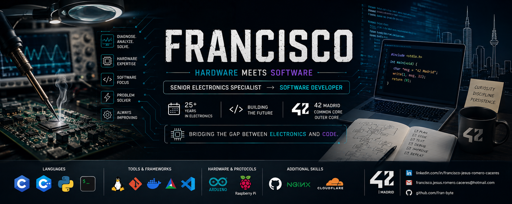

---

## 🔧 Senior Electronics Specialist → Software Developer

> **25+ years** diagnosing and repairing complex electronic systems.  
> Currently training in **software development** at [42 Madrid](https://42madrid.com/).  
> Bridging the gap between **hardware** and **software** to build innovative solutions.

---

## 🎯 About Me

With over two decades of experience as a **Senior Electronics Technician**, I've developed a deep understanding of:

- 🔬 **PCB diagnostics** at component level
- ⚡ **Power supplies** and analog/digital circuits
- 🏦 **Complex electromechanical systems** (ATMs, cash recyclers)
- 📡 **Embedded systems** and industrial communication protocols

Today, I'm combining this hardware expertise with **software development skills** acquired through the rigorous peer-to-peer methodology at **42 Madrid**; one of the world's most innovative programming schools.

---

## 🛠️ Tech Stack

| Languages | Tools & Frameworks | Hardware & Protocols |
|-----------|-------------------|----------------------|
|  |  |  |

---

## 🚀 Featured Projects

### 🏃 [Reaction Time System](https://github.com/fran-byte/reaction-time)
> **Measurement of Reaction Time in Starting Blocks**
- ESP8266-based device with ADXL345 accelerometer
- WiFi interface for real-time data visualization
- Used for athletics training optimization
- **Tech:** C++, Arduino, ESP8266, I2C, Web Server

---

### 🐚 [minishell](https://github.com/fran-byte/42-minishell)
> **Custom Unix Shell Implementation**
- Built from scratch in C
- Support for pipes, redirections, environment variables
- Command history and signal handling
- **Tech:** C, POSIX, Linux system calls

---

### 🎮 [cub3D](https://github.com/fran-byte/42-cub3d)
> **3D Graphics Engine with Raycasting**
- Wolfenstein-style 3D rendering engine
- Texture mapping and sprite management
- Minimalist graphics library (minilibx)
- **Tech:** C, Raycasting, Graphics Programming

---

### 🧲 [MagSenseUI](https://github.com/fran-byte/MagSenseUI)
> **Diagnostic Interface for Magnetic Sensors**
- Graphical interface for sensor calibration
- Real-time data visualization
- **Tech:** Python, PyQt, Serial Communication

---

### 📚 [libft](https://github.com/fran-byte/42-libft)
> **Custom C Standard Library**
- Reimplementation of standard C functions
- Additional utility functions for string manipulation, memory management, and linked lists
- **Tech:** C, Make, Unit Testing

---

## 📊 GitHub Stats

  

---

## 🏆 42 Madrid — Common Core

| Project | Description | Status |
|---------|-------------|--------|
| [transcender](https://github.com/fran-byte/42-ft-Transcender) | real-time multiplayer blackjack platform | ✅ Complete |
| [libft](https://github.com/fran-byte/42-libft) | Custom C library | ✅ Complete |
| [minishell](https://github.com/fran-byte/42-minishell) | Unix shell implementation | ✅ Complete |
| [cub3D](https://github.com/fran-byte/42-cub3d) | 3D raycasting engine | ✅ Complete |
| [push_swap](https://github.com/fran-byte/42-push_swap) | Sorting algorithm | ✅ Complete |
| [so_long](https://github.com/fran-byte/42-so_long) | 2D game with minilibx | ✅ Complete |
| [pipex](https://github.com/fran-byte/42-pipex) | Unix pipelines | ✅ Complete |

---

## 📬 Connect with Me

---

> *"From hardware to software — bridging the gap between electronics and code."*

---

⭐ **If you find my work interesting, feel free to star a repo or connect with me!**
